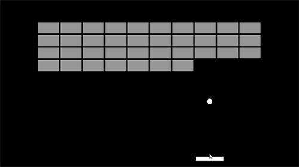
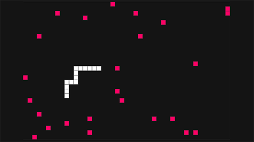
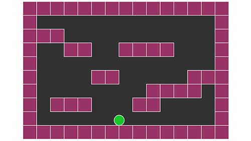
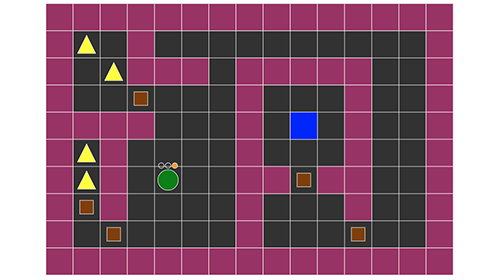
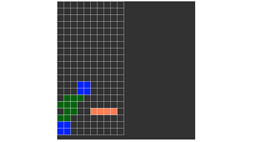
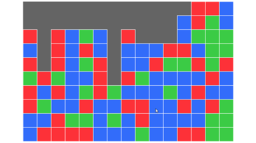

# Games with p5.js

## About

This repository showcases a diverse range of captivating games, all built using the powerful [p5.js](https://p5js.org/) library.

The inspiration for many of these games comes from the brilliant work of [Daniel Shiffman](http://twitter.com/shiffman) and his incredible YouTube channel, [The Coding Train](https://www.youtube.com/channel/UCvjgXvBlbQiydffZU7m1_aw). Through his tutorials and creative coding projects, Daniel has inspired countless developers and artists to explore the exciting world of coding.

I used materials from the Udemy's course [How to Program Games: Tile Classics in JS for HTML5 Canvas](https://www.udemy.com/course/how-to-program-games/) taught by [Chris DeLeon](https://hometeamgamedev.com/).

The [tutorial](https://www.youtube.com/watch?v=gww_4GBZnjc) that I followed for the Tetris game.

## Examples

|  |  |  |
| :---: | :---: | :---: |
| [Breakout](https://vislupus.github.io/p5-games/breakout/index.html) | [Snake](https://vislupus.github.io/p5-games/snake/index.html) | [Jumper](https://vislupus.github.io/p5-games/jumper/index.html) |

|  |  |  |
| :---: | :---: | :---: |
| [Warrior](https://vislupus.github.io/p5-games/warrior/index.html) | [Tetris](https://vislupus.github.io/p5-games/tetris/index.html) | [sameGame](https://vislupus.github.io/p5-games/sameGame/index.html) |

## Contribution

I welcome contributions from the community to enhance this collection of simulations. If you have an idea for a new simulation or an improvement to an existing one, please feel free to submit a pull request. Together, we can make this repository an even richer resource for learning and creativity.

## License

This repository is licensed under the [MIT License](LICENSE). You are free to use the code and adapt it for your own projects.

## Acknowledgements

I would like to express my gratitude to [Daniel Shiffman](http://twitter.com/shiffman) for his invaluable contributions to the coding community and for inspiring the simulations in this repository. Additionally, I would like to thank the p5.js community for their continuous support and the developers behind the p5.js library for providing such a powerful and accessible tool.